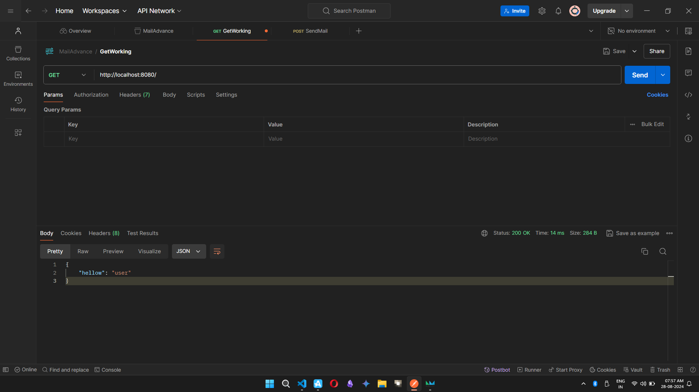
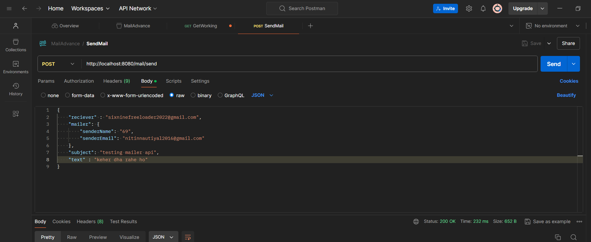
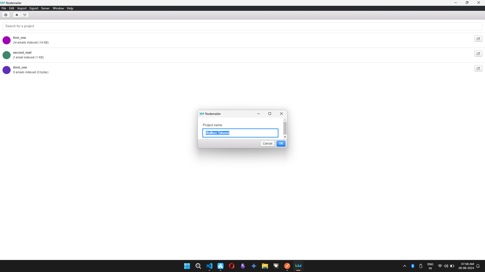
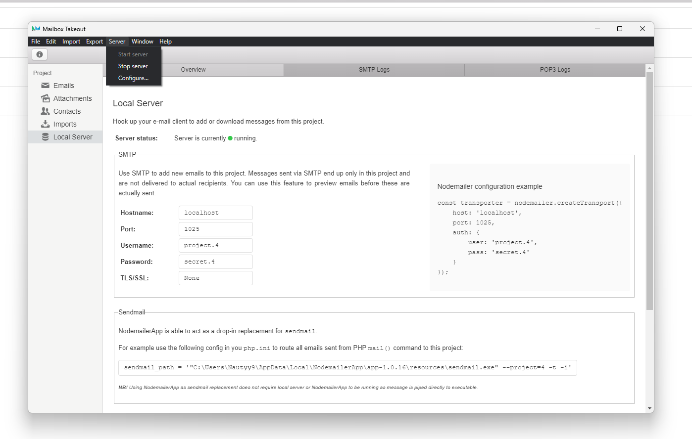

# Node Mail App with Nodemail
> Get Started
* npm install
* npm start
> ## Initial get request 

> ## Create the Post request to the Url  and send the Req body 

> ## Download nodemail app and create a new server(Go to File and create new )

> ## Start the provider/server

 * make sure to create atleast 2 provider , to check for the fallback mechanism , to ensure that uncomment the code from the dist/utils/mailConfig.ts 
